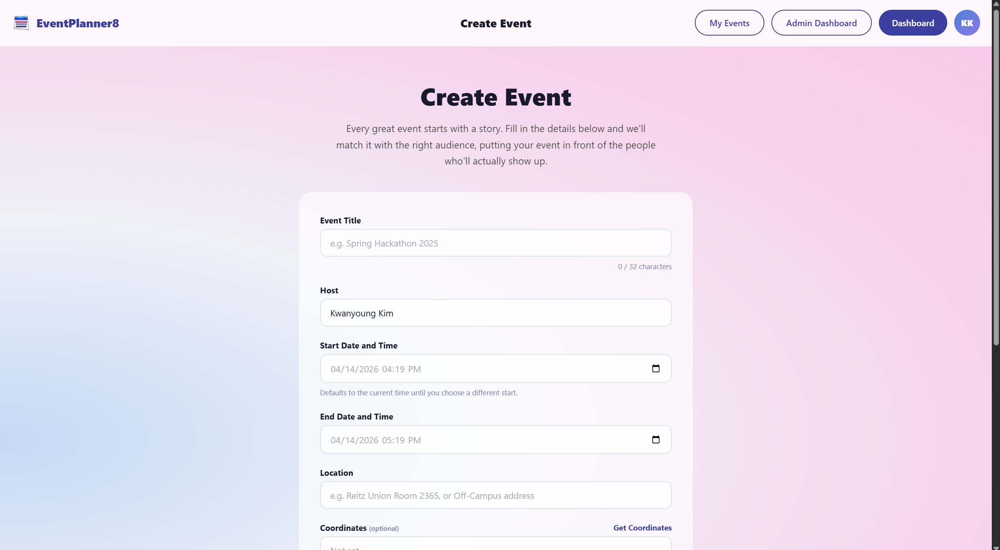
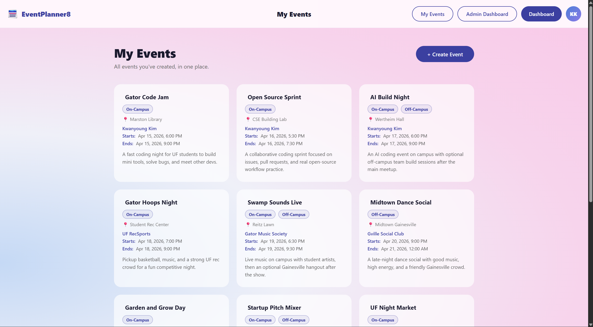
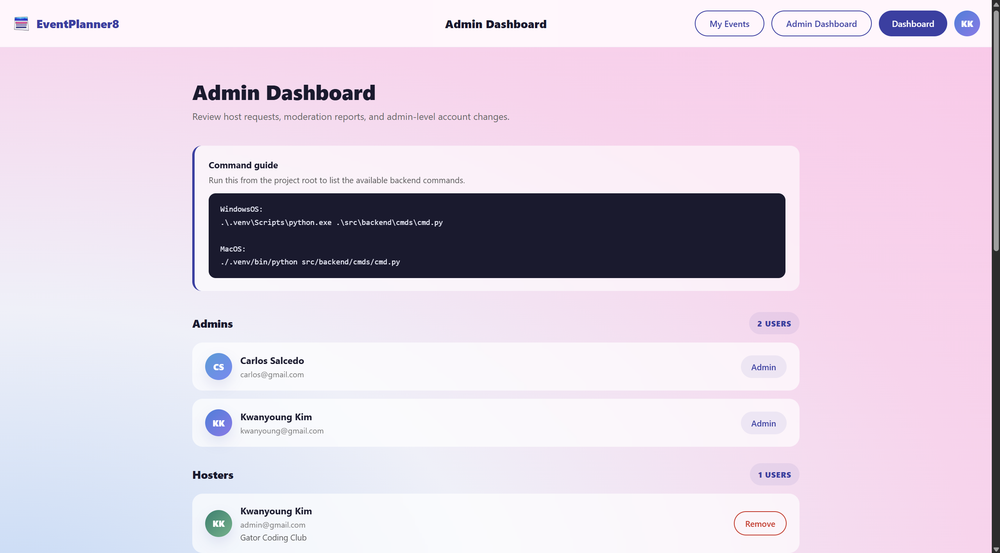
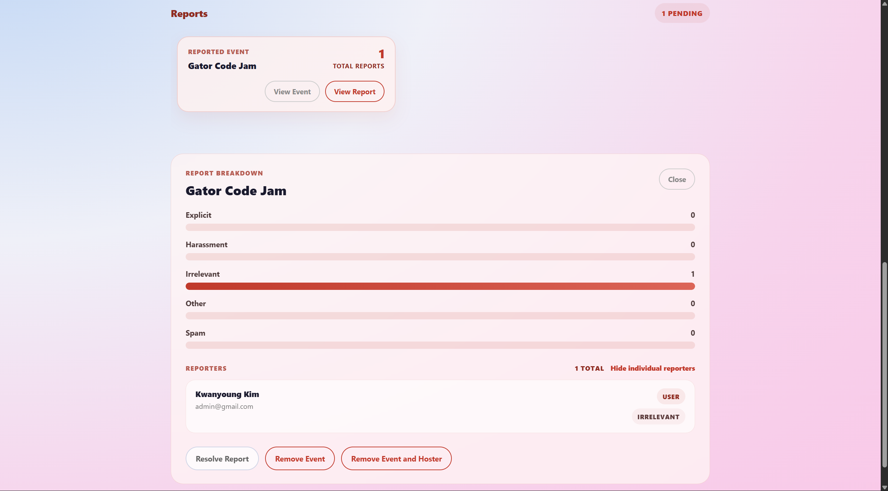

# EventPlanner8

> Your all-in-one platform for events near you.

Whether you're trying to get more involved this year or just looking to try new things, **EventPlanner8** is the solution. Our platform connects users with local events tailored to their interests, powered by personalized recommendations and a secure, verified host ecosystem.

Visit our deployment demo at [https://eventplanner8.com/](https://eventplanner8.com/) or [https://eventplanner8.koyeb.app/](https://eventplanner8.koyeb.app/).

---

## Features

- **Personalized Suggestions:** Get event suggestions tailored to your interests, so you can quickly find things you actually enjoy.
- **Location-Based Events:** See events near you and discover what's happening around campus and in your local area.
- **Security in Mind:** Verified hosts and active moderation keep listings trustworthy, so the community stays safe and welcoming.
- **Host and Admin Controls:** Verified hosters can create and manage events, while admins can review reports and moderate event hosts.
- **Guided Onboarding:** New users complete onboarding to set their interests and event preferences before entering the main dashboard.

---

## Screenshots


*Figure 1. Home page.*


*Figure 2. Sign up page.*


*Figure 3. Log in page.*


*Figure 4. Onboarding page.*


*Figure 5. Dashboard page.*


*Figure 6. Event details page.*


*Figure 7. Report event page.*


*Figure 8. Profile page.*


*Figure 9. Host registration page.*


*Figure 10. Create event page.*


*Figure 11. My events page.*


*Figure 12. Admin dashboard page.*


*Figure 13. Admin dashboard reports page.*

---

## Tech Stack

### Frontend
This directory contains every feature as part of our front-end for our application.
- [React](https://react.dev/) (v19)
- [React Router](https://reactrouter.com/): client-side routing

### Backend
This directory contains every feature as part of our back-end for our application.
- [Python](https://www.python.org/): server-side logic and API
- [FastAPI](https://fastapi.tiangolo.com/): API framework
- [Uvicorn](https://www.uvicorn.org/): ASGI web server
- [MongoDB](https://www.mongodb.com/): database for users and events
- [Hugging Face](https://huggingface.co/): open-source machine learning models and inference for the recommendation and classification system

### Recommendation/Classification Engine
Both the event recommendation and classification system are powered by Hugging Face models running inside a Hugging Face Space.

The recommendation engine allows sorting feeds by similar title by user preferences or tags.

The classification engine allows automatically moderating innapropriate event content and perform other smart classification operations.

Both engines support batching, allowing efficient processing with multiple inputs in one request.

Libraries used:
- [Hugging Face Transformers](https://huggingface.co/docs/images/transformers/index): model loading and tokenizer utilities
- [ONNX Runtime](https://onnxruntime.ai/): optimized inference engine for running the model
- [Optimum ONNX](https://huggingface.co/docs/images/optimum/index): Hugging Face integration for ONNX models
- [NumPy](https://numpy.org/): numerical computation for vector operations
- [Gradio](https://www.gradio.app/): interface used to host the Hugging Face Space API

Model used:
- [keisuke-miyako/all-MiniLM-L6-v2-onnx-fp16](https://huggingface.co/keisuke-miyako/all-MiniLM-L6-v2-onnx-fp16): An optimized version of the MiniLM embedding model used for semantic similarity between event descriptions and user interests
- [MoritzLaurer/ModernBERT-base-zeroshot-v2.0](https://huggingface.co/MoritzLaurer/ModernBERT-base-zeroshot-v2.0): a ModernBERT-based zero-shot classification model designed for fast and efficient classification

Additional information regarding setting up the recommendation engine and classification engine are located in [DOCS.md](DOCS.md).

---

## Getting Started

### Prerequisites
- Node.js & npm
- Python 3.x
- MongoDB

### Run the Frontend

```bash
cd src/frontend
npm install
npm start
```

The app will be available at `http://localhost:3000`.

### Run the Backend

```bash
cd src/backend
pip install -r requirements.txt
uvicorn main:app --reload
```

The backend will be available at `http://localhost:8000`.

### Hybrid Deployment

The backend can also serve the built frontend in production. This is the setup used for a single-service deployment such as Koyeb.

Build the frontend, copy the build output into the backend, and then start FastAPI:

```bash
cd src/frontend
npm install
npm run build
```

Then copy `src/frontend/build` to `src/backend/frontend_build` before starting the backend. On deployment platforms, set:

- `WORKDIR` to `src/backend`
- `RUN COMMAND` to `uvicorn main:app --host 0.0.0.0 --port $PORT`
- `PING_DOMAIN` to your public app URL, such as `https://eventplanner8.com/` or `https://eventplanner8.koyeb.app/`

When the frontend build is present, `GET /` returns the React app. If no build is present, the backend falls back to the JSON health response.

For Koyeb specifically, prefer the repository root `Dockerfile` instead of Buildpacks. The frontend and backend live in separate directories, and the Dockerfile builds both into one image without relying on cross-directory build commands.

### Run the Full Stack

If your VS Code workspace is configured to launch both the React frontend and FastAPI backend together, you can run the full stack by pressing `Run` in VS Code.

Read [DOCS.md](DOCS.md) if you want to host your own recommendation and classification engine. Otherwise, you can use the default configured endpoint.

---

## Pages & Routes

| Route | Description |
|-------|-------------|
| `/` | Landing / Home |
| `/login` | User login |
| `/signup` | New user registration |
| `/onboarding` | Required first-time setup for signed-in users |
| `/dashboard` | Main app dashboard |
| `/dashboard/:eventId` | Event details page |
| `/profile` | User profile |
| `/create-event` | Create an event |
| `/edit-event/:eventId` | Edit an event |
| `/my-events` | Hosted events page |
| `/report-event/:eventId` | Report an event |
| `/host-registration` | Register as an event host |
| `/admin` | Admin dashboard |
| `/about` | About the platform |

---

## Contributing

This is a student group project for **CEN3031**. Please follow the team's branching and PR conventions when contributing.

Made with passion by the students at the University of Florida.

---
